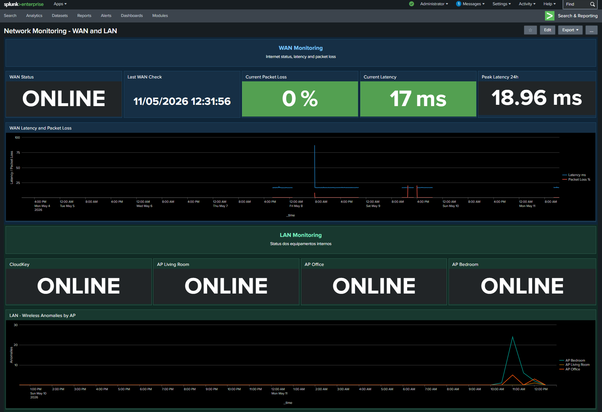
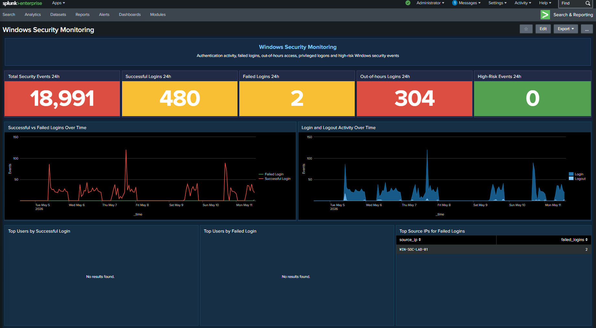
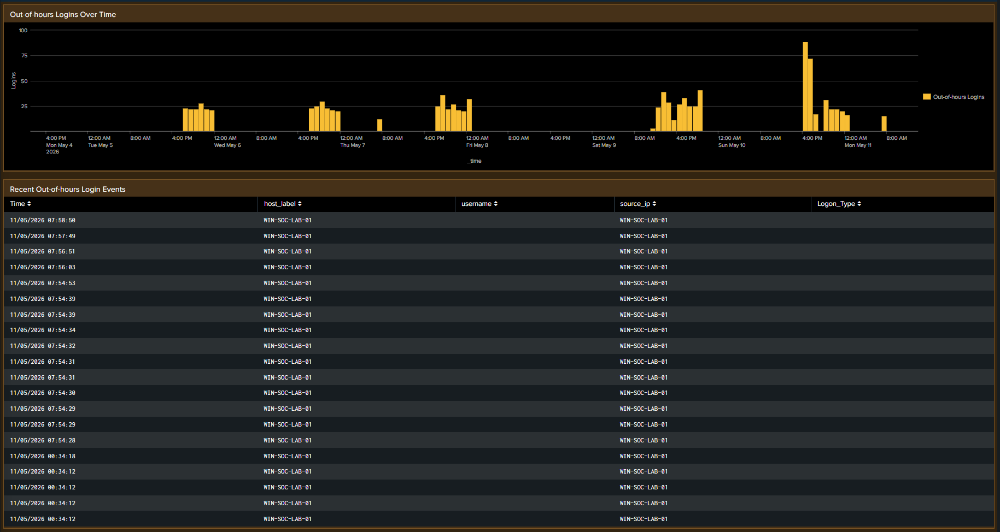
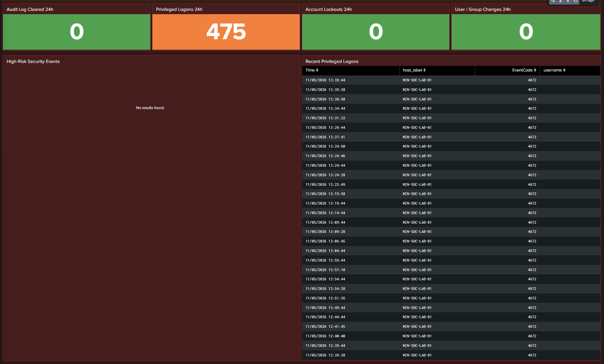

# Splunk Home SOC Lab - Network and Windows Security Monitoring

This project documents the creation of a personal SOC/NOC lab using Splunk Enterprise to monitor WAN availability, latency, packet loss, UniFi device status, wireless anomalies and Windows security events.

The goal of this lab is to practice log ingestion, SPL searches, dashboard creation, network visibility, Windows Event Log analysis and basic security monitoring using a real home lab environment.

---

## Project Objectives

- Build practical Splunk dashboards for home SOC/NOC monitoring
- Monitor WAN availability, latency and packet loss
- Track the last WAN health check
- Identify peak latency over a 24-hour period
- Monitor UniFi devices such as CloudKey and Access Points
- Detect and visualize wireless anomalies from UniFi logs
- Monitor Windows Security Event Logs
- Track successful and failed logins
- Identify out-of-hours login activity
- Monitor privileged logons and high-risk Windows security events
- Practice SPL searches and log parsing
- Customize Splunk dashboards using Classic XML
- Practice Windows Event Log analysis for SOC use cases
- Create a foundation for a future home SOC lab

---

## Technologies Used

- Splunk Enterprise
- SPL - Search Processing Language
- Splunk Classic Dashboards XML
- UniFi / CloudKey logs
- Linux server
- Syslog
- Custom WAN monitoring script
- Home network infrastructure
- Windows Event Logs
- Splunk Universal Forwarder
- Windows Security auditing

---

## Dashboard Overview

The lab currently includes two main Splunk dashboards:

1. Network Monitoring Dashboard
2. Windows Security Monitoring Dashboard

The Network Monitoring dashboard is divided into WAN and LAN monitoring areas.

The WAN section focuses on internet availability and connection quality.

The LAN section focuses on internal UniFi device status and wireless anomalies.

The Windows Security Monitoring dashboard focuses on authentication activity, failed logins, out-of-hours access, privileged logons and high-risk Windows security events.

### Network Monitoring Dashboard

Combined WAN and LAN monitoring view:



### Windows Security Monitoring Dashboard

Authentication overview, login activity and failed login sources:



Out-of-hours login detection and recent events:



High-risk events and privileged logon monitoring:



---

## WAN Monitoring

The WAN monitoring section uses a custom log source that checks internet connectivity and sends the result to Splunk.

Example log format:

```text
target=8.8.8.8 packet_loss=0% avg_latency=17.403ms
```

Current WAN indicators:

- WAN status
- Last WAN check
- Current packet loss
- Current latency
- Peak latency in the last 24 hours
- Latency and packet loss over time

Example SPL search for WAN status:

```spl
index=main sourcetype=wan_monitor
| rex "packet_loss=(?<packet_loss>\d+)%"
| rex "avg_latency=(?<avg_latency>[\d\.]+)ms"
| eval packet_loss=tonumber(packet_loss)
| eval avg_latency=tonumber(avg_latency)
| sort - _time
| head 1
| eval status=case(
    packet_loss=100, "OFFLINE",
    packet_loss>0, "DEGRADED",
    avg_latency>100, "HIGH LATENCY",
    true(), "ONLINE"
)
| table status
```

Example SPL search for WAN latency and packet loss over time:

```spl
index=main sourcetype=wan_monitor
| rex "packet_loss=(?<packet_loss>\d+)%"
| rex "avg_latency=(?<avg_latency>[\d\.]+)ms"
| eval packet_loss=tonumber(packet_loss)
| eval avg_latency=round(tonumber(avg_latency),2)
| timechart span=5m avg(avg_latency) as "Latency ms" avg(packet_loss) as "Packet Loss %"
```

---

## LAN Monitoring

The LAN monitoring section uses UniFi logs to monitor internal network devices.

Current LAN indicators:

- CloudKey status
- Access Point status
- Wireless anomalies by Access Point

Devices are considered online when recent logs are received by Splunk.

Current monitored devices:

- CloudKey
- AP Living Room
- AP Office
- AP Bedroom

For public sharing, the dashboard XML uses generic placeholders instead of real internal hostnames or IP addresses:

```text
unifi-cloudkey
AP_LIVING_ROOM_IP
AP_OFFICE_IP
AP_BEDROOM_IP
```

These placeholders should be replaced with the real hostnames or IP addresses used in the local Splunk environment.

Example SPL search for device status:

```spl
index=unifi earliest=-10m host="AP_LIVING_ROOM_IP"
| stats latest(_time) as last_seen
| eval age=now()-last_seen
| eval status=if(isnull(last_seen) OR age>600,"OFFLINE","ONLINE")
| table status
```

Example SPL search for wireless anomalies:

```spl
index=unifi earliest=-24h host IN ("AP_LIVING_ROOM_IP","AP_OFFICE_IP","AP_BEDROOM_IP") "anomalies="
| rex "anomalies=(?<anomaly>[^\s]+)"
| eval dispositivo=case(
    host=="AP_LIVING_ROOM_IP","AP Living Room",
    host=="AP_OFFICE_IP","AP Office",
    host=="AP_BEDROOM_IP","AP Bedroom",
    true(),host
)
| timechart span=30m count by dispositivo
```

---

## Windows Security Monitoring

The Windows Security Monitoring dashboard uses Windows Event Logs collected through Splunk Universal Forwarder.

The objective is to monitor authentication activity and identify security-relevant events that are useful in a basic SOC lab.

Current Windows indicators:

- Total Security Events in the last 24 hours
- Successful logins
- Failed logins
- Out-of-hours logins
- High-risk security events
- Privileged logons
- Account lockouts
- User and group changes

The dashboard also includes visual panels for:

- Successful vs failed logins over time
- Login and logout activity over time
- Out-of-hours logins over time
- Top users by successful login
- Top users by failed login
- Top source IPs for failed logins
- High-risk security events
- Recent privileged logons

The lab currently monitors Windows Security events using:

```text
index=main sourcetype="WinEventLog:Security"
```

In other environments, this index may be different, such as:

```text
index=windows sourcetype="WinEventLog:Security"
```

Example SPL search for successful and failed logins:

```spl
index=main sourcetype="WinEventLog:Security" earliest=-7d (EventCode=4624 OR EventCode=4625)
| eval event_type=case(
    EventCode=4624,"Successful Login",
    EventCode=4625,"Failed Login"
)
| timechart span=1h count by event_type
```

Example SPL search for out-of-hours logins:

```spl
index=main sourcetype="WinEventLog:Security" EventCode=4624 earliest=-7d
| eval hour_num=tonumber(strftime(_time,"%H"))
| eval weekday=strftime(_time,"%A")
| where hour_num<8 OR hour_num>=18 OR weekday="Saturday" OR weekday="Sunday"
| timechart span=1h count as "Out-of-hours Logins"
```

Example SPL search for high-risk Windows security events:

```spl
index=main sourcetype="WinEventLog:Security" earliest=-24h EventCode IN (1102,4720,4726,4728,4732,4740)
| stats count as high_risk_events
```

Relevant Windows Event IDs used in this lab:

| Event ID | Description |
|---|---|
| 4624 | Successful logon |
| 4625 | Failed logon |
| 4634 | Logoff |
| 4672 | Special privileges assigned |
| 4720 | User account created |
| 4726 | User account deleted |
| 4728 | User added to privileged group |
| 4732 | User added to local group |
| 4740 | Account locked out |
| 1102 | Audit log cleared |

For privacy, real hostnames are masked in the dashboard output. For example, internal Windows hostnames are displayed as:

```text
WIN-SOC-LAB-01
```

This allows the dashboard to be shared publicly without exposing real internal device names.

---

## Repository Structure

```text
splunk-home-soc-lab/
├── README.md
├── dashboards/
│   ├── network-monitoring-wan-lan.xml
│   └── windows-security-monitoring.xml
├── docs/
│   ├── architecture.md
│   ├── data-sources.md
│   └── lessons-learned.md
└── images/
    ├── network-monitoring-dashboard.png
    ├── windows-security-authentication-overview.png
    ├── windows-security-out-of-hours-logins.png
    └── windows-security-high-risk-events.png
```

---

## Data Sources

### WAN Monitor

The WAN monitor is based on a custom script that checks connectivity against a public target and sends the result to Splunk.

Example event:

```text
target=8.8.8.8 packet_loss=0% avg_latency=17.403ms
```

Available fields:

- target
- packet_loss
- avg_latency

### UniFi Logs

UniFi logs are used to monitor device activity and wireless anomalies.

Current usage:

- Device availability based on recent logs
- Wireless anomaly detection
- Access Point activity visibility

Current limitation:

The current UniFi syslog events do not provide full traffic consumption metrics such as RX/TX bytes per Access Point.

### Windows Event Logs

Windows Event Logs are collected using Splunk Universal Forwarder.

Current source type:

```text
WinEventLog:Security
```

Current usage:

- Authentication monitoring
- Failed login detection
- Out-of-hours login detection
- Privileged logon monitoring
- High-risk event monitoring
- User and group change visibility

The Windows dashboard uses Security Event IDs such as `4624`, `4625`, `4672`, `4720`, `4726`, `4728`, `4732`, `4740` and `1102`.

Real hostnames are masked in dashboard tables using generic lab names such as `WIN-SOC-LAB-01`.

---

## Dashboard Files

The Splunk Classic Dashboard XML files are available at:

```text
dashboards/network-monitoring-wan-lan.xml
dashboards/windows-security-monitoring.xml
```

The dashboards include:

- Visual separation between monitoring areas
- Status cards
- Time-based line charts
- Tables for investigation
- Custom colors using Classic XML styling
- Placeholder hostnames/IPs for safe public sharing
- Masked internal hostnames for privacy

---

## Skills Practiced

This project helped me practice:

- Splunk log ingestion
- SPL search creation
- Field extraction using `rex`
- Data transformation using `eval`
- Aggregation using `stats`
- Time-based visualization using `timechart`
- Dashboard customization using Classic XML
- Basic SOC/NOC monitoring concepts
- Network availability monitoring
- Wireless anomaly visualization
- Windows Event Log analysis
- Splunk Universal Forwarder configuration
- Windows authentication monitoring
- Detection logic for out-of-hours activity
- Basic high-risk event identification
- Privacy masking of internal hostnames in dashboards
- Documentation for cybersecurity portfolio projects

---

## Lessons Learned

During this lab, I learned the difference between event monitoring and traffic monitoring.

The current UniFi logs provide useful operational visibility, such as device activity and wireless anomalies. However, they do not provide complete bandwidth consumption metrics.

For true traffic monitoring, future versions of this lab should collect data using:

- UniFi API
- SNMP
- Dedicated exporters
- Custom scripts

The Windows Security Monitoring dashboard helped me understand how Windows Event Logs can be used for SOC-style monitoring. It also highlighted the importance of validating data ingestion, checking Universal Forwarder connectivity and confirming that Windows auditing policies are enabled.

During the lab, I also learned to distinguish between frequent privileged events, such as Event ID `4672`, and higher-risk events, such as audit log clearing, account creation, account deletion, group membership changes and account lockouts.

This project also reinforced the importance of creating clear dashboards that separate WAN, LAN and Windows Security visibility.

---

## Future Improvements

Planned improvements:

- Add UniFi API integration
- Add SNMP-based traffic collection
- Add WAN bandwidth consumption
- Add LAN traffic by Access Point
- Add device offline alerts
- Add packet loss and high latency alerts
- Add Telegram or email notifications
- Add firewall logs
- Add endpoint logs
- Add Sysmon logs
- Add PowerShell monitoring
- Add process creation monitoring
- Add detection rules for suspicious command execution
- Add Windows Defender logs
- Add alerting for high-risk Windows events
- Expand the lab into a complete home SOC environment

---

## Security and Privacy Notes

This public version does not include real public IP addresses, passwords, tokens, API keys or sensitive internal identifiers.

Some hostnames and IP addresses were replaced with placeholders to make the project safe for public sharing.

Internal Windows hostnames were masked in dashboard tables before public sharing. For example, real hostnames were replaced with generic lab identifiers such as `WIN-SOC-LAB-01`.

Before publishing screenshots or dashboard exports, sensitive information should be reviewed and removed.

---

## Disclaimer

This is a personal lab project created for learning and portfolio purposes. It is not intended to represent a production SOC environment.