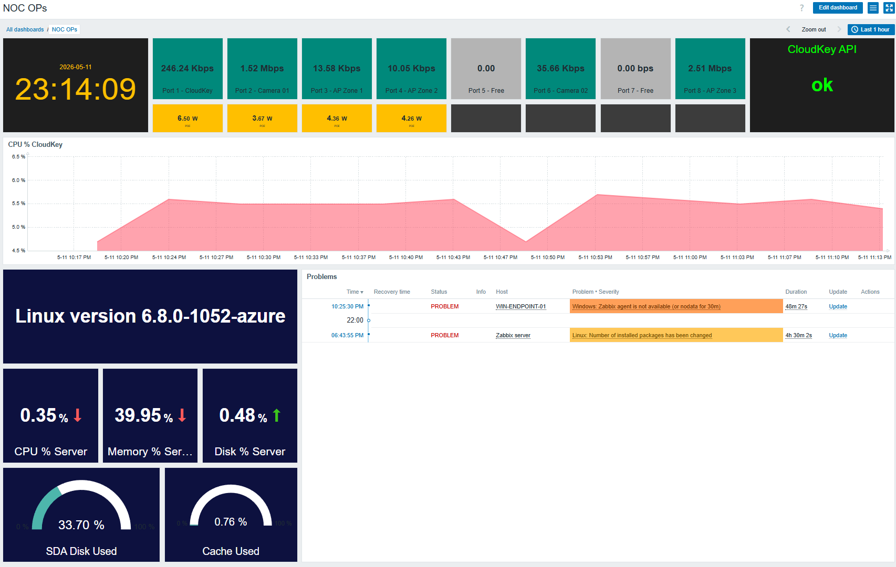

# Zabbix Home NOC Lab - Infrastructure and Network Monitoring

This project documents the creation of a personal NOC lab using Zabbix to monitor network infrastructure, UniFi devices, switch ports, server health and operational alerts.

The goal of this lab is to practice infrastructure monitoring, device availability checks, API-based monitoring, network visibility, dashboard creation and basic NOC operations using a real home lab environment.

---

## Project Objectives

- Build a practical Zabbix dashboard for home network and infrastructure monitoring
- Monitor UniFi network devices using the UniFi API
- Monitor switch port traffic in near real time
- Track PoE usage per switch port
- Monitor server CPU, memory, disk and cache usage
- Display active infrastructure problems
- Practice NOC-style dashboard design
- Create a visual monitoring layer to complement the Splunk SOC lab

---

## Technologies Used

- Zabbix Server
- Zabbix Agent
- Zabbix Agent Active
- UniFi Network Controller / CloudKey
- UniFi API
- UniFi Switch
- Linux server monitoring
- Windows endpoint monitoring
- SNMP testing
- ICMP availability checks
- Home network infrastructure

---

## Dashboard Overview

The dashboard provides a consolidated NOC view of the home lab environment.

It includes:

- Current time and operational view
- Switch port traffic cards
- PoE power usage per port
- UniFi CloudKey API status
- Switch CPU usage
- Linux server version
- Server CPU, memory and disk usage
- Disk and cache usage gauges
- Active infrastructure problems



---

## Network Port Monitoring

The dashboard includes visual cards for switch ports.

Each card shows the current traffic rate for a specific switch port.

Example monitored ports:

| Port | Description |
|---|---|
| Port 1 | CloudKey |
| Port 2 | Camera 01 |
| Port 3 | AP Zone 1 |
| Port 4 | AP Zone 2 |
| Port 5 | Free |
| Port 6 | Camera 02 |
| Port 7 | Free |
| Port 8 | AP Zone 3 |

The traffic cards show current port usage in Kbps or Mbps.

The PoE cards show power usage in watts for PoE-powered devices.

---

## UniFi API Monitoring

The UniFi CloudKey is monitored through the UniFi Network API.

This allows Zabbix to collect information about:

- UniFi device status
- Switch ports
- Access points
- Connected devices
- Port traffic
- PoE usage
- Device uptime
- Network availability

The dashboard includes a CloudKey API status card to confirm that the API integration is working.

For public sharing, sensitive values such as usernames, passwords, API tokens, MAC addresses and internal identifiers are not included.

---

## Server Monitoring

The Zabbix server is also monitored as part of the lab.

Current server metrics include:

- Linux version
- CPU usage
- Memory usage
- Disk usage
- Cache usage
- Installed package changes
- Active system problems

This provides visibility into the monitoring server itself and helps identify local infrastructure issues.

---

## Problems and Alerts

The dashboard includes a problems panel showing active operational issues.

Examples of monitored problems include:

- Zabbix agent unavailable
- Server package changes
- Device availability issues
- Monitoring data gaps

This helps simulate a basic NOC workflow where alerts are reviewed and investigated from a central dashboard.

---

## Architecture

The lab combines SOC and NOC concepts.

```text
UniFi CloudKey / Network Controller
        |
        | API
        v
Zabbix Server
        |
        v
NOC Dashboard
        |
        +--> Device metrics
        +--> Switch ports
        +--> PoE usage
        +--> Server health
        +--> Active problems